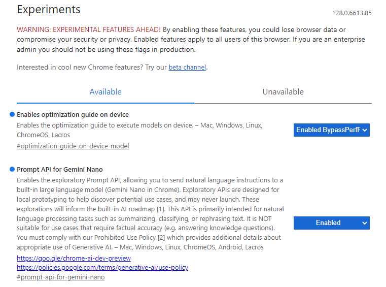
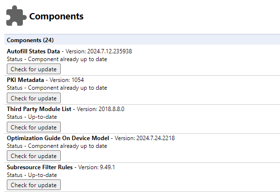

# extension-translate-gemini-nano

Chrome extension to translate web pages. Uses Gemini Nano as the backend.

## Prerequisites

This extension relies on experimental features of Chrome as of August 2024,
**It may not work in the future** due to changes in Chrome's functionality.
To use this extension, please proceed as follows:

1. Open `chrome://flags`, set the following two flags and restart Chrome.

    - Enables optimization guide on device: `Enabled BypassPerfRequirement`
    - Prompt API for Gemini Nano: `Enabled`  
    

2. Open `chrome://components` and wait until the Optimization Guide On Device Model Status becomes `Component already up to date`.  

For more information, please refer to [Built-in AI | AI on Chrome | Chrome for Developers](https://developer.chrome.com/docs/ai/built-in).

## Setup

1. Open 'Manage Extensions' page in Google Chrome browser.
2. Enable 'Developer mode'.
3. Click 'Load unpacked' and select `extension` directory.
4. Open 'Options' page and select the language.

## Usage

Select the text you want to translate and click on the extension icon.

## License

MIT License  
Copyright (c) 2024 Sadao Hiratsuka
