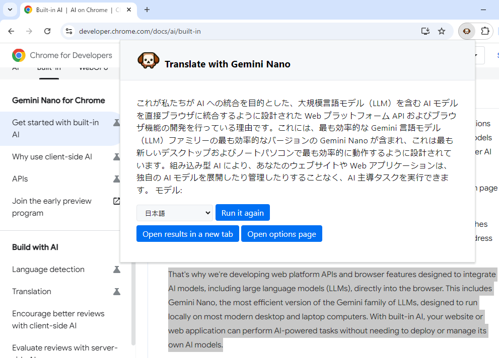

# extension-translate-gemini-nano

Chrome extension to translate web pages. Uses Gemini Nano as the backend.

**Note: This extension is not yet available for Chrome 126 (as of June 2024).**
It utilizes a built-in AI feature that will be implemented in Chrome in the future.
For more information, please refer to [Built-in AI | AI on Chrome | Chrome for Developers](https://developer.chrome.com/docs/ai/built-in).

## Setup

1. Open 'Manage Extensions' page in Google Chrome browser.
2. Enable 'Developer mode'.
3. Click 'Load unpacked' and select `extension` directory.
4. Open 'Options' page and select the language.

## Usage

Select the text you want to translate and click on the extension icon.

## License

MIT License  
Copyright (c) 2024 Sadao Hiratsuka
